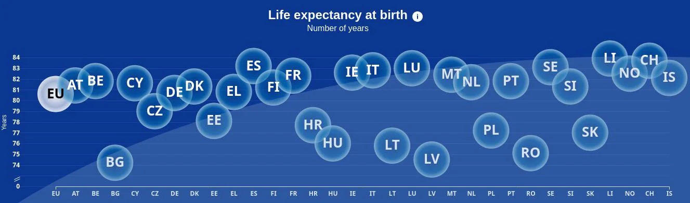

```{r setup, include=FALSE}
# Do not change these settings!
knitr::opts_chunk$set(warning = FALSE, message = FALSE)
```

### Assessment declaration checklist

Please carefully read the statements below and check each box if you agree with the declaration. If you do not check all boxes, your assignment will not be marked. If you make a false declaration on any of these points, you may be investigated for academic misconduct. Students found to have breached academic integrity may receive official warnings and/or serious academic penalties. Please read more about academic integrity [here](https://www.rmit.edu.au/students/student-essentials/assessment-and-exams/academic-integrity). If you are unsure about any of these points or feel your assessment might breach academic integrity, please contact your course coordinator for support. It is important that you DO NOT submit any assessment until you can complete the declaration truthfully. 

**By checking the boxes below, I declare the following:**

- <input type="checkbox" id="dec1" name="dec1" value="Agree"> I have not impersonated, or allowed myself to be impersonated by, any person for the purposes of this assessment 

- <input type="checkbox" id="dec2" name="dec2" value="Agree"> This assessment is my original work and no part of it has been copied from any other source except where due acknowledgement is made.

- <input type="checkbox" id="dec3" name="dec3" value="Agree"> No part of this assessment has been written for me by any other person except where such collaboration has been authorised by the lecturer/teacher concerned.

- <input type="checkbox" id="dec4" name="dec4" value="Agree"> Where this work is being submitted for individual assessment, I declare that it is my original work and that no part has been contributed by, produced by or in conjunction with another student.

- <input type="checkbox" id="dec5" name="dec5" value="Agree"> I give permission for my assessment response to be reproduced, communicated compared and archived for the purposes of detecting plagiarism.

- <input type="checkbox" id="dec6" name="dec6" value="Agree"> I give permission for a copy of my assessment to be retained by the university for review and comparison, including review by external examiners.

**I understand that:**

- <input type="checkbox" id="dec7" name="dec7" value="Agree"> Plagiarism is the presentation of the work, idea or creation of another person as though it is your own. It is a form of cheating and is a very serious academic offence that may lead to exclusion from the University. Plagiarised material can be drawn from, and presented in, written, graphic and visual form, including electronic data and oral presentations. Plagiarism occurs when the origin of the material used is not appropriately cited.

- <input type="checkbox" id="dec8" name="dec8" value="Agree"> Plagiarism includes the act of assisting or allowing another person to plagiarise or to copy my work.

**I agree and acknowledge that:**

- <input type="checkbox" id="dec9" name="dec9" value="Agree"> I have read and understood the Declaration and Statement of Authorship above.

- <input type="checkbox" id="dec10" name="dec10" value="Agree"> If I do not agree to the Declaration and Statement of Authorship in this context and all boxes are not checked, the assessment outcome is not valid for assessment purposes and will not be included in my final result for this course.


## Deconstruct

### Original

The original data visualisation selected for the assignment was as follows:

<br>
<center>

</center>
<center>*Source: Life Expectancy at Birth.*</center>
<br>


### Objective and Audience

The objective and audience of the original data visualisation chosen can be summarised as follows: 

**Objective**

This visualisation highlights the Life expectancy at birth which is a crucial measure that reflects the average number of years a person can expect to live, based on current mortality rates. This visualization focuses on the life expectancy at birth for European countries in 2021. Its goal is to offer a comprehensive overview of people's health across Europe. By displaying the average lifespan, the graph allows us to compare life expectancies among countries, highlighting where people tend to live longer or shorter lives. This insight is valuable for shaping healthcare strategies and policies aimed at promoting longer, healthier lives for all.

**Audience**

The intended audience for the visualization of life expectancy at birth for European countries in 2021 could include:

1. **Public Health Officials:** Health professionals and public health officials can use the visualization to assess the effectiveness of public health interventions and programs aimed at improving population health outcomes.

2. **Researchers:** Academics and researchers studying population health, and health inequalities can utilize the visualization for research purposes, identifying patterns and trends in life expectancy data.

3. **Health Advocates:** Organizations and advocates working to improve health equity and access to healthcare can use the visualization to raise awareness about health disparities and advocate for policy changes.

4. **General Public:** The general public can benefit from the visualization by gaining insights into population health outcomes and understanding how factors such as geography, socioeconomic status, and healthcare systems impact life expectancy.


### Critique

The visualisation chosen had the following three main issues:

1. **Failure to answer a practical question:** The visualization fails to effectively show the variation in life expectancy at birth across different european countries over a specific time period.

2. **Deceptive method:** The current data visualization lacks clarity and is confusing for the audience. Important chart elements such as title of x-axis is missing, making it difficult for viewers to interpret the data accurately. In particular, comparing the life expectancy of different European countries in the scatter plot is challenging due to the lack of precision in conveying exact life expectancy values for each country. Additionally, the large size of the data points further hinders clarity. 

3. **Perceptual and colour issues:** The inclusion of background wallpaper in the data visualization can make it hard for viewers to understand the data. Additionally, the wallpaper might clash with the colors used in the graph, making it tough to differentiate between different parts of the visualization. Ultimately, having background wallpaper can make the visualization less clear and harder to read, affecting its ability to effectively communicate life expectancy information.


## Reconstruct

### Code

The following code was used to fix the issues identified in the original. 

```{r}
# importing libraries

library(readr)
library(dplyr)
library(ggplot2)

# setting the path
setwd("/Users/pallavikollipara/Desktop/rmit/sem2/Data Visualization/Assignment 2")

# Creating the dataframe
life <- as.data.frame(read_csv("Life Expectancy at Birth.csv"))

# taking required columns
life_birth_21 <-life[, c(1:5, ncol(life))]

# Taking the Europian countries.
df <- life_birth_21 %>% filter(Continent == "Europe")

# renaming a column
colnames(df)[6]<- 'Life_Expectancy_2021'

# plotting the bar graph
graph <-ggplot(df, aes(y = reorder(Country, Life_Expectancy_2021), x = round(Life_Expectancy_2021, 1))) +
  geom_bar(stat = "identity", fill = "#0066cc", width = 0.8) +
  labs(title = "Life Expectancy at Birth in European Countries, 2021",
       x = "Years",
       y = "Countries") +
  geom_text(aes(label = round(Life_Expectancy_2021, 2)),
            hjust = 1.5, vjust = 0.5, 
            color = "white", size = 3.5) +   
  theme_minimal()+
  theme(panel.background = element_rect(fill = "white"),
        panel.grid.major = element_line(linewidth = 0.3,
                                        color = "gray", 
                                        linetype = "solid"), 
        panel.grid.minor = element_blank(),
        plot.title = element_text(size = 20), 
        axis.text.x = element_text(size = 10),
        axis.title.x = element_text(size = 16),
        axis.text.y = element_text(size = 10),
        axis.title.y = element_text(size = 16))
```


### Reconstruction

The following plot fixes the main issues in the original.

```{r fig.align="center", echo = FALSE, fig.width=10, fig.height=13}
graph
```

## References

* fatcatpoppy. (2024). Life expectancy at birth. Retrieved May 1, 2024, from reddit: https://www.reddit.com/r/dataisugly/comments/1cgmvp6/ew/#lightbox
* kaggle.n.d. Life Expectancy at Birth Across the Globe. Retrieved May 3, 2024, from  https://www.kaggle.com/datasets/iamsouravbanerjee/life-expectancy-at-birth-across-the-globe
* Stephen Few. (2008). Practical Rules for Using Color in Charts. Retrieved May 1, 2024, from Perceptual edge: http://www.perceptualedge.com/articles/visual_business_intelligence/rules_for_using_color.pdf 
